# 1. Описание
Disciples Mobile - пошаговая игра в жанре Turn Base RPG, с боями в стиле "Стенка на стенку", прокачкой существ и отстройкой Столицы, созданная на основе известной TBS Disciples 2. Разработка ведется уже 2 года в одиночку. Создавалось с целью лучшего понимания ООП.


## Игровой процесс: 
- выбор стартового героя (герой выбирается один раз за игру); 
- найм существ в Столице за золото;
- продвижение на карте Кампании; 
- участие в боях стенка на стенку; 
- отстройка Столицы;
- улучшение героя и существ;
- победа над главным Боссом.
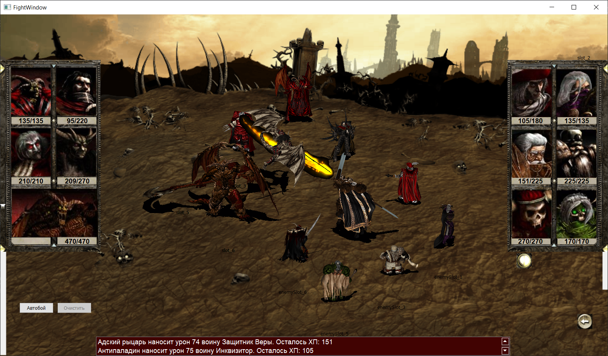

# 2. Стек технологий
- python 3;
- PyQt5;
- SQLAlchemy;
- sqlite / postgres;
- pyinstaller.

# 3. Инструкция по установке
- Способ 1 - exe-file Работает только на Windows. Скачиваем весь архив. Запускаем exe-file из папки 'dist'.
- Способ 2 - скачиваем весь архив. Устанавливаем все зависимости (файл requirements.txt). Запускаем client_main_window.py.
```bash
git clone git@github.com:Erepb-89/disciples-mobile.git
cd disciples-mobile
```

```bash
pip install -r requirements.txt
```

```bash
cd client_dir
python ../client_main_window.py
```

## Папка client_dir: 
- папка ui - все ui-файлы QTDesigner'а;
- папка forms - сформированные из ui-файлов формы;
- папка dialogs - диалоговые окна;
- папка windows - обычные окна;
- settings.py - файл настроек. Описаны константы и пути;
- ui_functions.py - статические ui-функции, которые используются в нескольких местах.

### Папка client_dir/windows:
- capital_window.py - логика главного окна Столицы;
- capital_army_window.py - логика окна армии в Столице, обмен юнитов;
- capital_building_window.py - логика окна постройки в Столице;
- choose_faction_window.py - логика окна выбора фракции;
- choose_hero_window.py - логика окна выбора героя;
- fight_window.py - визуализация битвы, все gif-файлы оживляются здесь (frontend), под капотом (backend) - battle.py, см. ниже.
- hire_menu_window.py - логика окна найма юнитов;
- message_window.py - окно сообщения, которое можно только закрыть;
- question_window.py - вопросительное окно с выбором Да/Нет. Передача родительскому окну подтверждения.

## Папка units_dir: 
- units_factory.py - классы юнитов, пригодных для найма в Столице, создаваемые фабричным методом;
- battle_unit.py - класс Unit, который используется в битве;
- units.py - Класс-оболочка для работы с базой данных. Реализован с помощью SQLAlchemy ORM;
- buildings.py характеристики всех построек Столицы;
- gif_parser.py использовался, чтобы разложить gif-файлы из оригинальной игры по папкам, по заданным мне параметрам;
- mission_generator.py - генератор случайных миссий в Кампании;
- models.py - классы юнитов игрока, как они хранятся в базе (не в битве);
- png_parser.py - для удобного переименования png-файлов (иконок построек в Столице) из оригинальной игры;
- ranking.py - настроечный файл. Ранги юнитов. Перки героев. Начисление золота по миссиям;

## Папка images: 
- все изображения (портреты, иконки юнитов, графика Столицы); 
- скриншоты;
- gif-анимация.

## Папка tests: 
- тесты (unittest).

## Папка dist: 
- exe-файл.

## battle.py 
- вся логика битвы: расчет очередности ходов, урона с учетом успешности атаки, брони, иммунитетов, защит. Получение опыта и уровней.

## battle_logging.py 
- логгер битвы.

## client_main_window.py 
- главное/стартовое окно игры ClientMainWindow. 

## disc2.db 
- база данных.

## backlog.txt
- бэклог. Реализованные и нереализованные фичи.

# 4. Инструкция по использованию (как играть)
## Новая игра
- Сначала нужно выбрать или создать игрока.
- Для выбора фракции нажать кнопку "Выбор фракции".
- Далее выбрать - продолжить игру или начать новую.
- Выбрать героя для старта (4 класса героев: боец, маг, стрелок и жезлоносец).
- В окне Армии можно нанять бойцов для отряда, посмотреть их характеристики, а также расставить своих существ.
- В окне Построек можно посмотреть ветви развития своих существ, все стадии их развития и что требуется для постройки зданий.
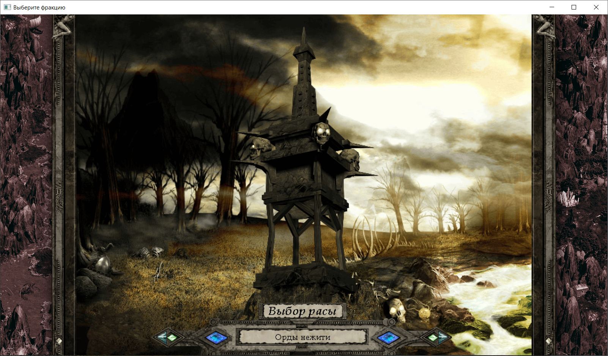
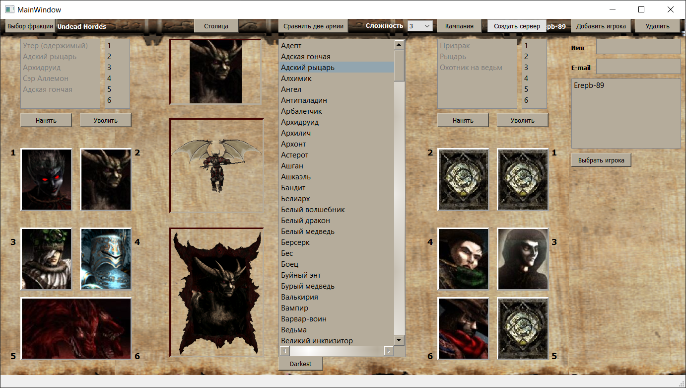

## Найм юнитов
- Для найма армии нужно зайти в "Столицу" и нажать на кнопку "Экран армии", либо нажать клавишу "P".
- Чтобы нанять юнита, нужно нажать на пустой слот рядом со слотом своего героя.
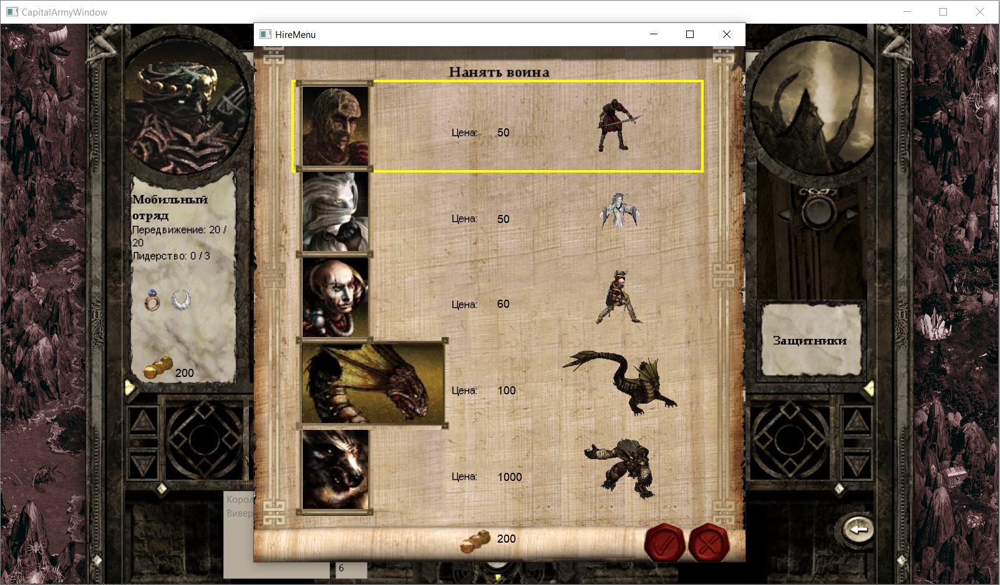

## Постройка в столице
- Для входа в окно Построек в главном окне Столицы нажать на кнопку "Построить здание", либо нажать клавишу "S".
- Откроется дерево постройки стрелков. Для выбора других ветвей существ, нужно переходить по кнопкам "Маги", "Бойцы", "Поддержка".
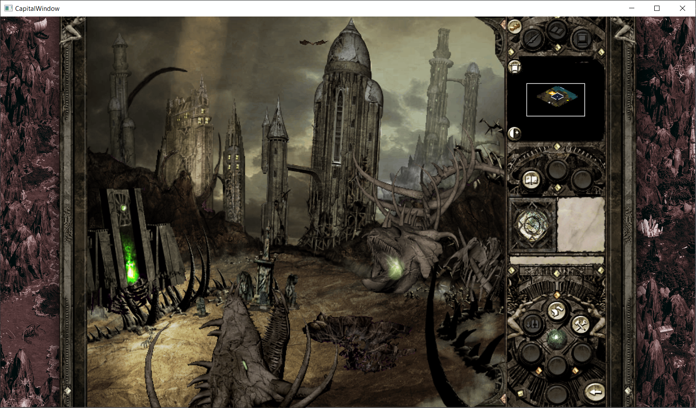
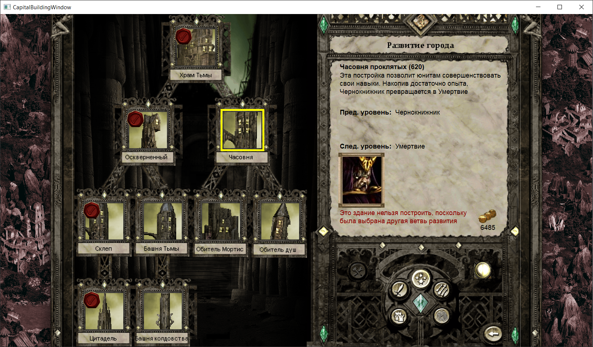
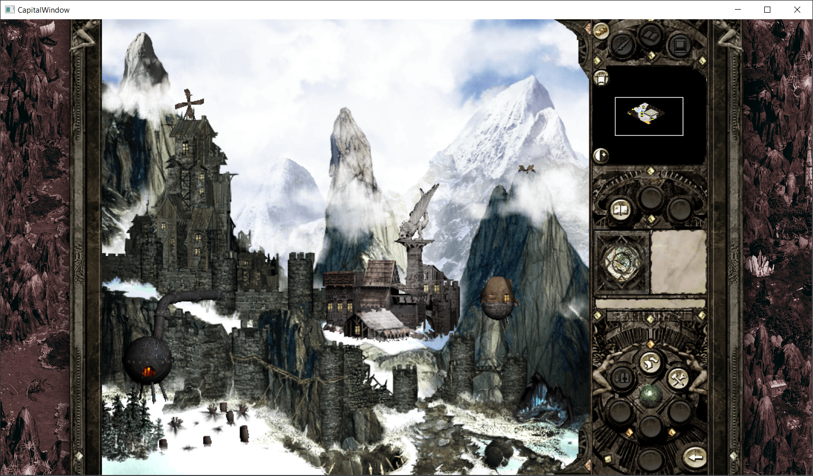
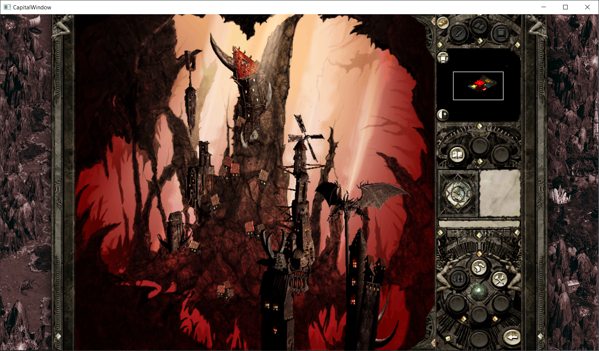
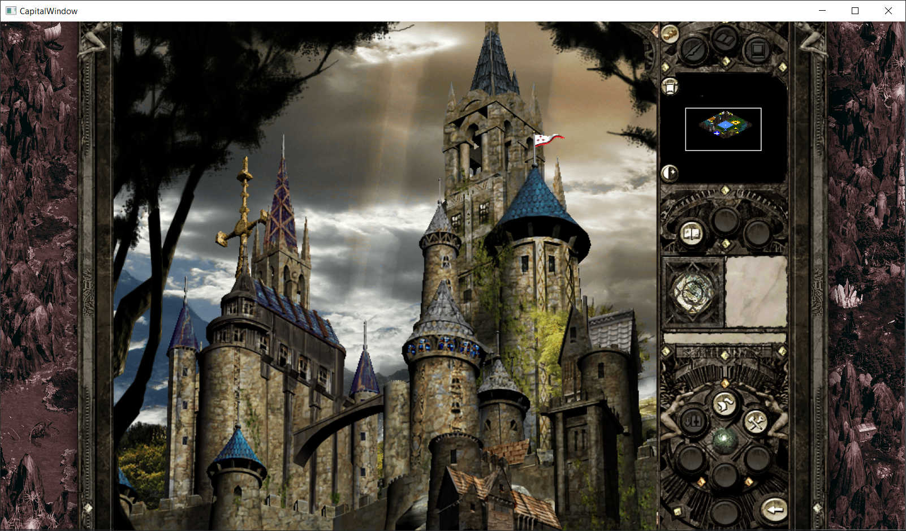

## Кампания
- Для начала Кампании нужно выйти на Главное окно (MainWindow) и выбрать Сложность от 1 до 3.
- Далее нажать кнопку Кампания. Откроется окно со случайно сгенерированными отрядами врагов, сквозь которых нужно пройти до главного Босса.
- Выбираем отряд, который хотим атаковать, при желании смотрим характеристики бойцов. Вокруг активного вражеского отряда будет красная рамка.
- Для нападения нажимаем кнопку "В бой!".
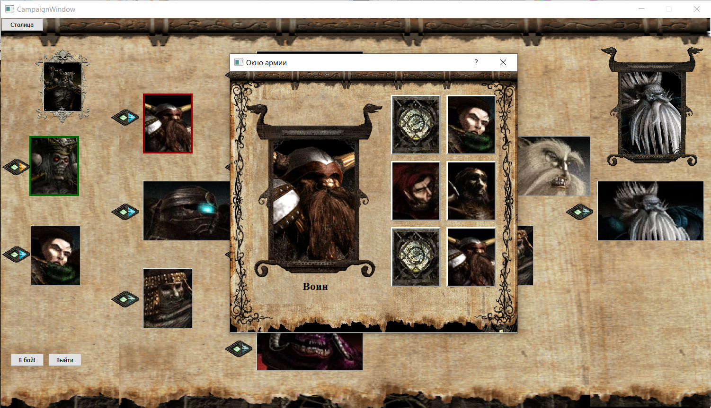

## Окно битвы
- Юниты ходят в порядке их Инициативы. Юниты с более высокой Инициативой ходят первыми.
- Для выбора цели можно навести курсор как на самого юнита, так и на его иконку. При нажатии ЛКМ активный юнит атакует выбранную цель.
- Кнопка "Автобой" - активное существо само атакует наиболее подходящую цель.
- Кнопка "Защита" - активный юнит пропускает ход и получает 50% бонус к Броне до совего следующего хода.
- Кнопка "Ожидание" - активный юнит переносится в конец по шкале Инициативы. Если ожидающих юнитов несколько, последним будет ходить наиболее инициативный.
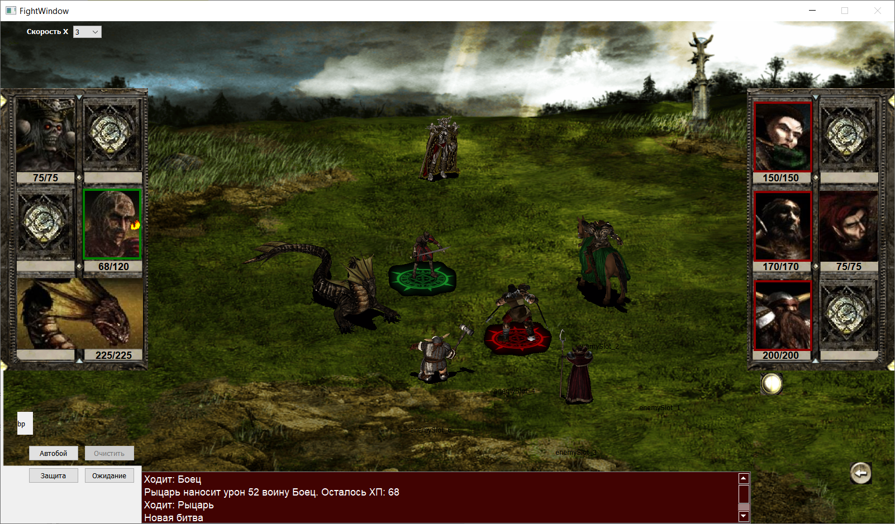
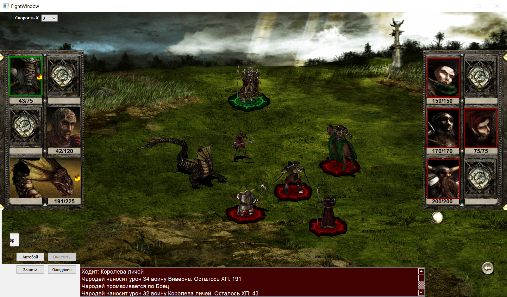
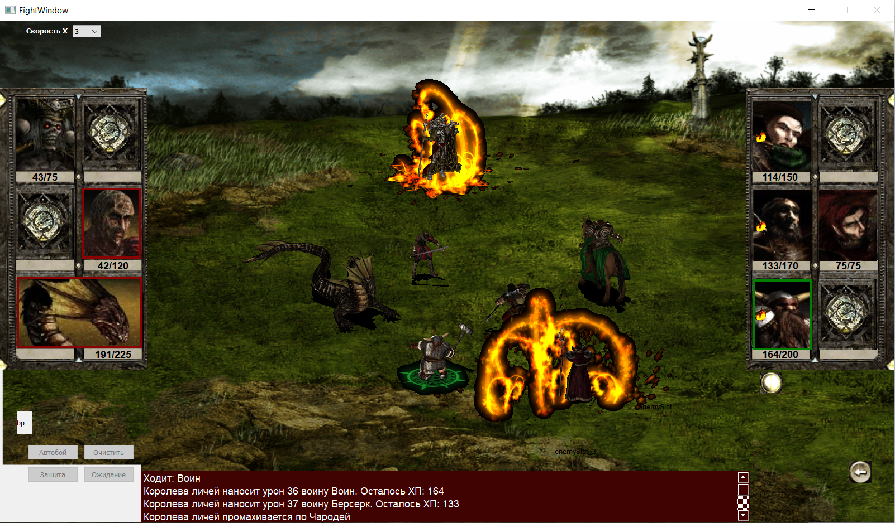

## Прокачка
- После победы в бою юниты и герой получают опыт, а игрок - золото. 
- При достижении нужного для повышения количества опыта, юнит переходит на следующую ступень развития. 
- Для повышения уровня существа должно быть отстроено соответствующее здание в Столице за золото. 
- Герои при переходе на новый уровень получают повышенные характеристики и случайный перк (способность). 
- В конце каждого уровня кампании будет поджидать Босс. За победу над Боссом нас будет ждать повышенная награда, а также переход на следующий уровень Кампании. 
- Всего в Кампании 3 уровня на Сложностях 1 и 2. И 4 уровня Кампании на Сложности 3.
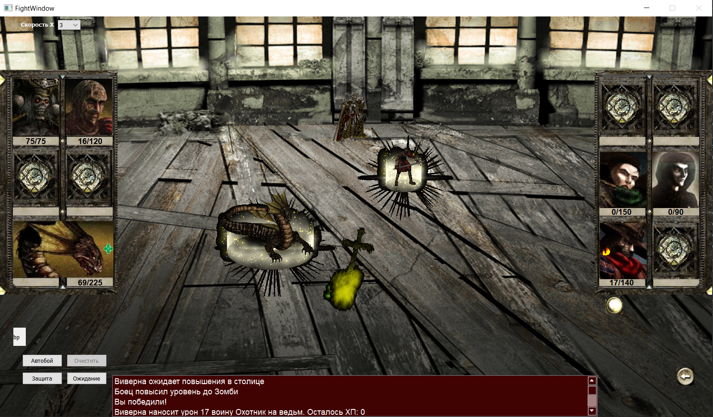
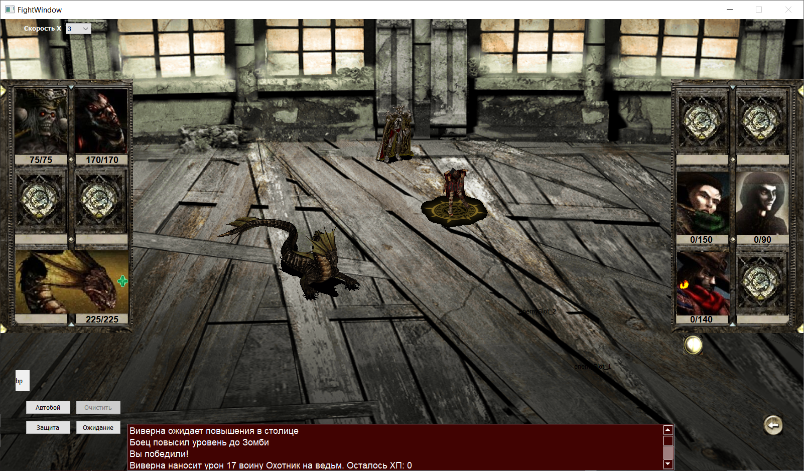
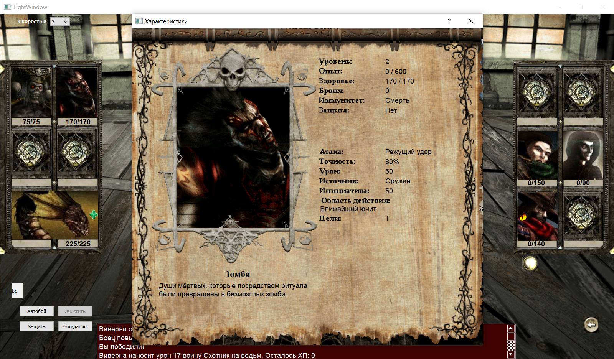
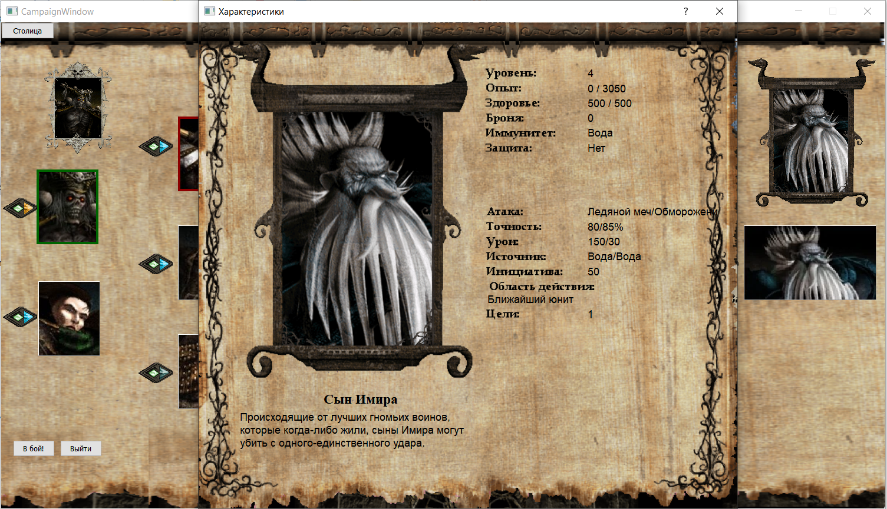

## Реализованные фичи
О реализованных и нереализованных фичах читаем backlog.txt.
Информация обновляется в тг-боте @disciples_mobile. Бот содержит также описание всех юнитов и фракций игры.
